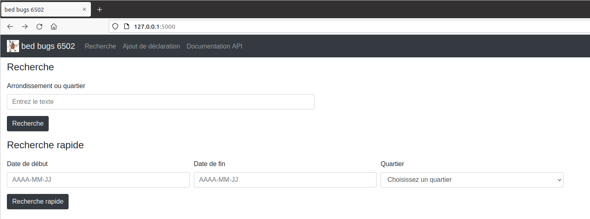
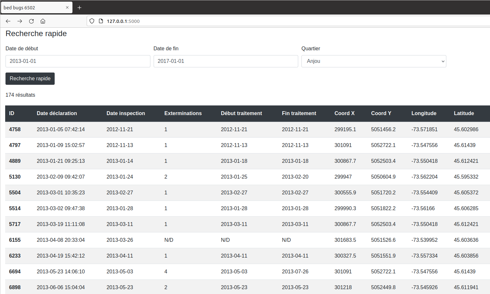
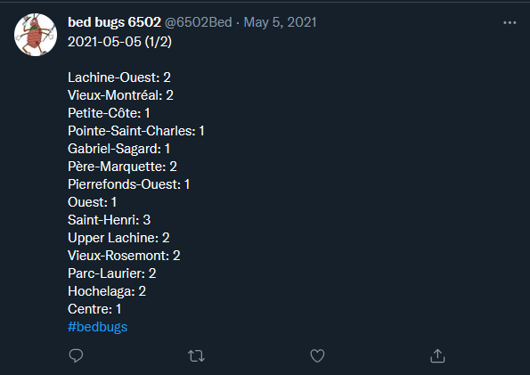
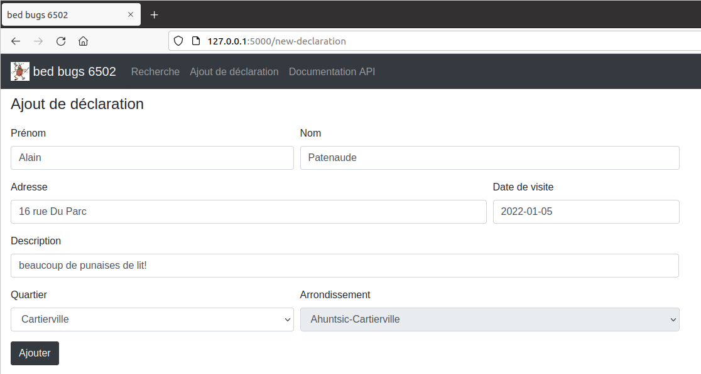

# bed bugs 6502

## Présentation 

bed bugs 6502 est mon projet de session dans le cadre du cours [INF5190](https://etudier.uqam.ca/cours?sigle=INF5190) - Programmation Web avancée du Baccalauréat en informatique et génie logiciel de l'UQAM. Le projet consiste à récupérer un ensemble de données provenant de la ville de Montréal sur les déclarations de punaise de lits et d'offrir des services à partir de ces données, soit un site web et un API REST. Il s'agit d'un backend Flask/Python et d'un frontend jinja2 avec Bootstrap.

Il y avait 20 fonctionnalités possibles à développer, chacun valant des points et faire le travail seul nécessitait d'en faire plusieurs mais pas toutes. J'ai donc choisi de compléter les fonctionnalités A1 à A6, B1, B2, C1 à C3, D1 à D3 et E1. Pour une description détaillée de chacune, vous pouvez consulter le [PDF de l'énoncé](enonce.pdf). De plus, il y a un ficher [correction.md](correction.md) détaillant comment tester chacune d'elles. Ci-bas sera seulement faite une description sommaire de ce qui a été implémenté.

## Installation

Pour rouler l'application, il faut installer en premier lieu les librairies et dépendances. Après avoir installé Python 3.9.1, SQLite3 (`sudo apt install sqlite3` sur Ubuntu) et pip (`sudo apt install python3-pip` sur Ubuntu), il faut entrer à la racine du projet la commande `pip install -r requirements.txt`. Cette commande installera toutes les dépendances.

Pour partir l'application, il faut entrer à la racine du projet la commande `FLASK_APP=app.py` suivi de `flask run`. Le site web devrait alors être accessible sur le port 5000 sur localhost (`http://127.0.0.1:5000/`).

## Fonctionnalités

### A1
La liste des déclarations est obtenue en format CSV à l'aide d'une requête HTTP et son contenu est stocké dans une base de données SQLite.

### A2
Créer un outil de recherche qui permet de trouver les déclarations par nom de quartier ou nom d'arrondissement.

### A3
Mettre en place un BackgroundScheduler dans l’application Flask afin d’extraire les données de la ville de Montréal à chaque jour, à minuit, et mettre à jour les données de la base de données.

### A4
Le système offre un service REST permettant d'obtenir la liste des déclarations ayant eu lieu entre deux dates spécifiées en paramètre.

### A5
Créer un outil de recherche rapide par dates avec l'aide de requêtes Ajax.

### A6
Ajouter au point A5 un mode de recherche par nom du quartier.

### B1
Le système détecte les nouvelles déclarations depuis la dernière importation de données, en dresse une liste sans doublon et l'envoi par courriel automatiquement.

### B2
Le nombre de nouvelles déclarations par quartier est publié automatiquement sur un [compte Twitter](https://twitter.com/6502Bed).

### C1
Le système offre un service REST permettant d'obtenir la liste des quartiers contenant une ou plusieurs déclarations.

### C2
Le système offre un service permettant d'obtenir exactement les mêmes données que le point C1 mais en format XML.

### C3
Le système offre un service permettant d'obtenir exactement les mêmes données que le point C1 mais en format CSV.

### D1
Le système offre un service REST permettant de faire une déclaration d’extermination à la ville.

### D2
Le système offre un service REST permettant de supprimer une déclaration.

### D3
Modifier l'application faite en A5 afin de pouvoir supprimer les déclarations retournées par l'outil de recherche. Ainsi, on peut supprimer d’un seul coup toutes les déclarations d’un quartier complet.

### E1
Le système offre un service REST permettant à un utilisateur de se créer un profil d'utilisateur.

## Librairies et dépendances

Toutes les librairies et dépendances suivantes sont installées avec le fichier `requirements.txt`. Les autres dépendances et librairies présentes dans `requirements.txt` ont été automatiquement installées par celles dans la liste suivante:

[Flask 1.1.2](https://pypi.org/project/Flask/)
[requests 2.25.1](https://pypi.org/project/requests/)
[APScheduler 3.7.0](https://pypi.org/project/APScheduler/)
[flask-json-schema 0.0.5](https://pypi.org/project/flask-json-schema/)
[dicttoxml 1.7.4](https://pypi.org/project/dicttoxml/)
[pandas 1.2.4](https://pypi.org/project/pandas/)
[PyYAML 5.4.1](https://pypi.org/project/PyYAML/)
[python-dotenv 0.17.0](https://pypi.org/project/python-dotenv/)
[tweetpy 3.10.0](https://pypi.org/project/tweepy/)
[python-dateutil 2.8.1](https://pypi.org/project/python-dateutil/)

## Documentation RAML

La documentation de l'API a été générée avec [raml2html](https://www.npmjs.com/package/raml2html). Elle vient déja générée avec le projet sur la route `/doc` mais si au besoin on veut la regénérer on peut installer raml2html avec la commande `npm i -g raml2html` et ensuite à la racine du projet lancer la commande `raml2html doc.raml > templates/doc.html`.

## Environnement de développement

Le développement s'est fait sur une machine virtuelle Ubuntu 20.04.2 LTS. La version de python est 3.9.1 et celle de SQLite3 est 3.34.0.
